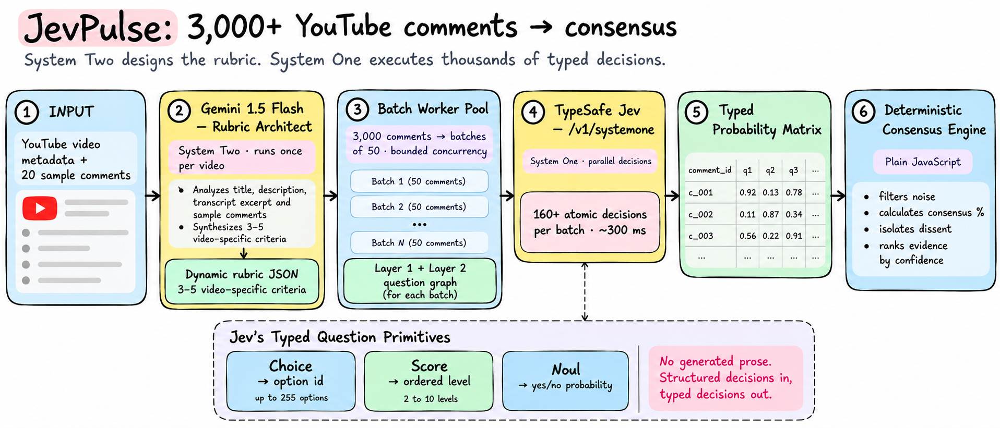

# JevPulse

> High-throughput qualitative consensus engine for YouTube comments. Evaluates every comment individually with calibrated decision models.

JevPulse replaces conversational summarization with a **Dual-Process AI Architecture**: use a reasoning model once to design the schema, evaluate thousands of comments in parallel using TypeSafe Jev, and compute consensus deterministically in code.

**Live Demo**: [jevpulse.vercel.app](https://jevpulse.vercel.app/)  


## System Architecture

The pipeline decouples high-level reasoning from high-throughput execution across four stages:




---

## Architectural Stages

### Stage 1: Dynamic Rubric Synthesis (System Two)
Static categories (*positive*, *negative*, *neutral*) fail across different domains. A coding tutorial needs evaluation on *code clarity* and *pacing*, while a hardware review needs evaluation on *thermal throttling* and *pricing value*.

Gemini Flash is invoked **once per video** using the title, description, transcript excerpt, and 20 sample comments. It outputs a structured rubric where each criterion defines:
- **Evaluative Question**: Closed question directed at an individual comment.
- **Affirmative Boundary**: Explicit criteria for what fulfills the dimension.
- **Negative Distractor Boundary**: Similar-sounding remarks that must be rejected to prevent semantic drift.

### Stage 2: Dual-Layer Question Topology (System One)
For every comment in a batch, the engine builds a two-layer evaluation graph:
- **Layer 1: Universal Semantic Invariants (Runs on every video)**
  - `is_opinion` (`noul`): Binary probability separating substantive discourse from greetings, spam, and timestamps.
  - `comment_type` (`choice`): Categorical intent (*praise*, *criticism*, *question*, *suggestion*, *agreement*, *disagreement*, *correction*, *experience*, *other*).
  - `specificity` (`score`): 3-point ordinal score measuring argument depth and empirical detail.
  - `has_claim` (`noul`): Binary probability measuring whether the utterance asserts a verifiable factual claim.
- **Layer 2: Dynamic Rubric Stance (Video-Specific)**
  - One `noul` question per criterion generated in Stage 1, measuring the comment's affirmative probability on that specific dimension.

### Stage 3: High-Throughput Speculative Fan-Out
Comments in each batch are bundled into a single shared `state`. Jev ingests the state once and evaluates all Layer 1 and Layer 2 questions across all batch comments concurrently in memory. Adding questions barely impacts latency because decisions evaluate in parallel over shared memory rather than generating tokens sequentially.

### Stage 4: Deterministic Synthesis & Consensus Math
Jev outputs typed numbers and distributions. Application code retains complete ownership of aggregation, thresholding, and business logic:
- **Signal Gating**: Filters out low-entropy comments using calibrated `isOpinion` and `specificity` thresholds before computing consensus.
- **Consensus Ratios**: Computes true percentage agreement across the filtered substantive manifold.
- **Principled Dissent Isolation**: Silence is not dissent. A comment is classified as opposing only if it has a low affirmative score *and* actively exhibits critical communicative intent (*criticism*, *disagreement*, *correction*).
- **Confidence-Calibrated Provenance**: Ranks supporting and dissenting evidence by absolute semantic confidence ($|P - 0.5|$) rather than social likes, preventing viral jokes or spam from distorting the report. Every metric directly links back to source comment IDs.

---

## Performance & Cost

| Metric | Traditional Chat LLM (GPT-4o / Claude 3.5) | JevPulse (Gemini + TypeSafe Jev) |
|---|---|---|
| **Mechanism** | Autoregressive text generation | Calibrated discriminative decisions |
| **Input Pricing** | ~$2.50 – $3.00 / Mtok | **$0.042 / Mtok** (outputs free) |
| **Cost per 3,000 comments** | ~$2.40 – $4.50 | **~$0.025 – $0.04** (~100x cheaper) |
| **Total Evaluation Latency** | 45 – 120 seconds | **~1.6 – 2.0 seconds** |
| **Schema Guarantees** | Probabilistic JSON parsing errors | Strictly typed values and floats |
| **Data Integrity** | Compression loss / Hallucinated counts | 100% individual comment provenance |

---

## API Endpoints

- **`POST /analyze`**: Analyzes a YouTube video URL and returns the complete consensus report as JSON.
- **`GET /analyze/stream`**: Server-Sent Events (SSE) endpoint providing real-time batch progress, processed comment counts, and live decision streaming.

---

## Getting Started

### Prerequisites
- Node.js 18+
- API keys for [TypeSafe AI](https://console.typesafe.ai), [Google Gemini](https://aistudio.google.com/), and [YouTube Data API v3](https://console.cloud.google.com/)

### Installation

```bash
# Clone the repository
git clone https://github.com/jaygajera17/JevTube.git
cd JevTube

# Configure environment variables
cp .env.example .env

# Install dependencies
npm install

# Start local server
npm run dev
```


